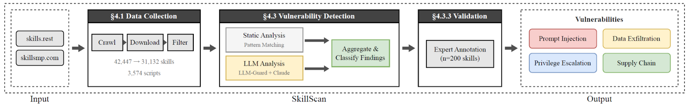
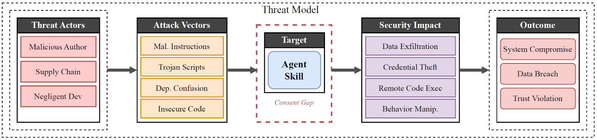

## SkillScan

AI agent frameworks now support agent skills - modular packages of instructions and executable code that extend agent capabilities - yet skills load and execute dynamically with minimal human review, creating a dangerous trust asymmetry. We present the first large-scale empirical study of this emerging attack surface, collecting 42,447 skills from two marketplaces and security-scanning 31,132 using SkillScan, our multi-stage detection framework combining static analysis with LLM-based semantic classification. The results are concerning: 26.1% of skills contain at least one potential vulnerability, with data exfiltration patterns (13.3%) and privilege escalation risks (11.8%) most prevalent. We identified 14 distinct vulnerability patterns across 8 functional categories. We contribute a vulnerability taxonomy grounded in 8,126 vulnerable skills, a validated detection methodology achieving 86.7% precision and 82.5% recall, and release our annotated dataset and detection tools to support future research.





Annotation data are available at [skillscan-annotation](skillscan-annotation).

### Usage

```bash
python skillscan.py <action> [options]
```

Available actions and options:

- `crawl`: Crawl skill marketplaces to collect skills.
  - `skillsrest`: Crawl skills from skills.rest
  - `skillsmp`: Crawl skills from skillsmp.com
- `merge`: Merge crawled skill data into a unified dataset.
- `check`: Run vulnerability detection on the dataset.
  - `security_scan`: Run the SkillScan vulnerability detection pipeline.
  - `llm_guard`: Run LLM Guard scanners.

### Dataset

All collected skills are available at [Anonymous for Review, to be replaced with actual link upon publication]().

The directory contains approximately 36,000 Claude Skill files, totaling about 465 GB.
The dataset is archived using POSIX tar (without compression) and split into multiple parts.
The files in this deposition follow the naming pattern:

```
skills_part_aa
skills_part_ab
skills_part_ac
...
```

Each part is a sequential chunk of a single tar archive.

To reconstruct the original directory structure and files, download all skills_part_* files and run the following command in the same directory:

```shell
cat skills_part_* | tar -xf -
```

This command will restore the original directory with all files in their original paths.

#### Notes

- No compression is applied to ensure robustness, faster extraction, and lower risk of corruption.

- All files must be present for successful recovery.